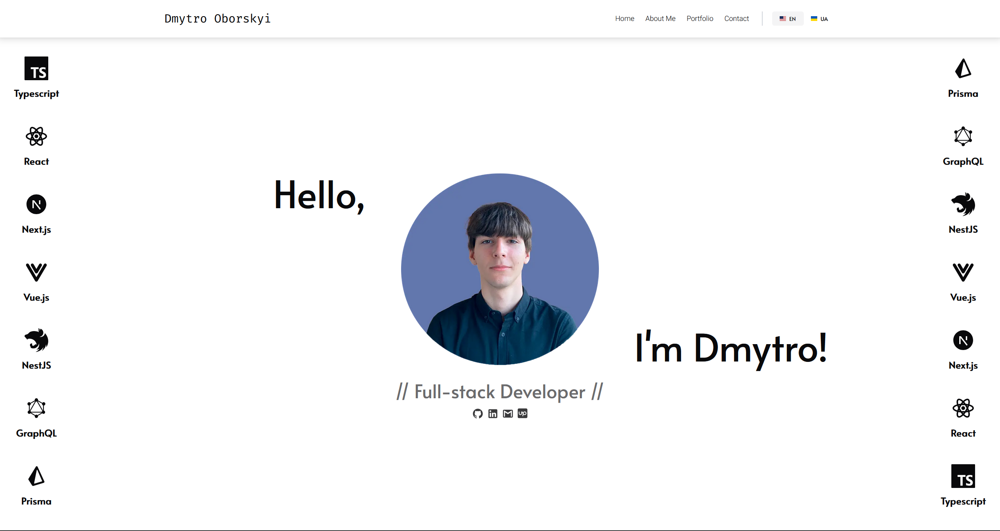

# Dmytro Oborskyi's Portfolio Website

Welcome to the repository for my personal portfolio website. This project serves as a professional showcase of my skills, projects, and expertise in web development. It is built using modern web technologies to ensure high performance, scalability, and maintainability.

## 🌍 Live Demo

Explore the live version of the website:  
🔗 **[dmytro-oborskyi.com](https://dmytro-oborskyi.com)**

<p align="center">
  <a href="https://dmytro-oborskyi.com" target="_blank"></a>
</p>

---

## 🚀 Features

- **⚡ Responsive Design:**  
  The website is fully responsive and adapts seamlessly to different screen sizes, ensuring an optimal user experience across desktops, tablets, and mobile devices.

- **🚀 Fast Performance:**  
  Optimized for speed and efficiency, providing users with smooth navigation and quick load times.

- **🔍 SEO Optimization:**  
  Built with best SEO practices in mind to improve search engine visibility and organic reach.

- **🌍 Multi-language Support (EN/UK):**  
  The website is available in both **English** and **Ukrainian**, making it accessible to a broader audience.

- **📡 Own API with REST & GraphQL:**  
  The backend supports both **REST API** and **GraphQL**, offering flexible data fetching options. API documentation is available via **Swagger**.

- **📧 Email Service Integration:**  
  Includes a fully functional **email service**, allowing users to send messages via contact forms.

---

## 🛠️ Technologies Used

### **📦 Monorepo & Tooling**

- **🏗 Nx Monorepo** – A powerful build system for managing multiple projects in a single repository, optimizing performance, and improving developer workflow.
- **📜 TypeScript** – Strongly typed language for better maintainability and scalability.
- **📏 ESLint & Prettier** – Ensures code quality and consistent formatting.

### **Frontend:**

- **⚡ TypeScript** – Ensures type safety and scalability.
- **⚛ React.js** – Component-based library for building interactive UI.
- **⚡ Next.js** – React framework for enhanced performance, SSR, and SEO optimization.
- **🎨 Tailwind CSS** – Utility-first styling framework for fast and consistent UI development.

### **Backend:**

- **🚀 NestJS** – Progressive Node.js framework for scalable and maintainable backend development.
- **🔗 GraphQL** – API query language for efficient data retrieval.
- **🐳 Docker** – Containerized environment for seamless deployment.
- **⚙️ Swagger** – API documentation for better usability.

### **Custom Libraries:**

- **📡 dmytro-oborskyi_network** – A custom GraphQL Code Generator library for streamlined API interaction.

### **Deployment:**

- **🌐 Vercel** – Hosting solution for the frontend, ensuring fast performance and auto-deployments.
- **⚙️ Railway** – Cloud-based platform for hosting the backend with seamless CI/CD integration.

---

## 🏗️ Getting Started

Follow these steps to set up the project locally:

### 1️⃣ Clone the Repository

```bash
git clone https://github.com/EcchiGrill/dmytro-oborskyi.git
```

### 2️⃣ Navigate to the Project Directory

```bash
cd dmytro-oborskyi
```

### 3️⃣ Install Dependencies

Using Yarn:

```bash
yarn install
```

Or using npm:

```bash
npm install
```

### 3️⃣ Setup Frontend & Backend

The project is divided into frontend and backend parts, each with its own setup. Follow the respective setup guides:

- 📂 Frontend Setup: **[apps/web/README.md](https://github.com/EcchiGrill/dmytro-oborskyi/blob/main/apps/web/README.md)**
- 📂 Backend Setup: **[apps/api/README.md](https://github.com/EcchiGrill/dmytro-oborskyi/blob/main/apps/api/README.md)**

Navigate to the respective folders and follow the installation steps provided in each README.md file.

---

## 📜 License

This project is licensed under the MIT License.
See the LICENSE file for more details.

## 🔥 Thank you for visiting my portfolio! If you have any questions or suggestions, feel free to reach out. Happy coding! 😊
