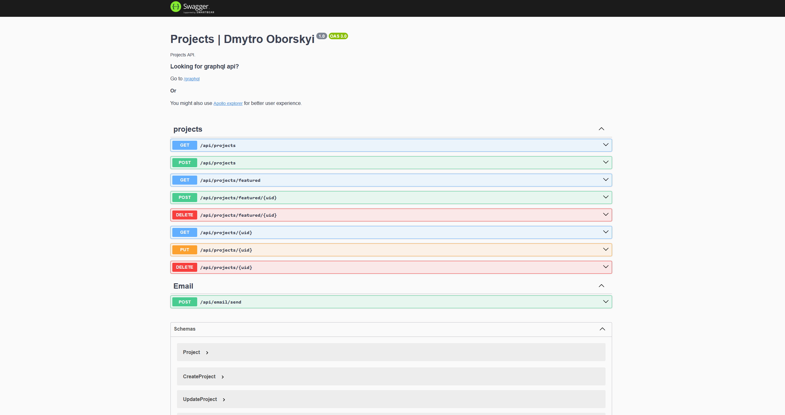

<p align="center">
  <a href="http://localhost:4200/docs" target="_blank"></a>
</p>

## Compile and run the project

```bash
# development
$ yarn dev

# production mode
$ yarn prod
```

## Description

My [Website](https://dmytro-oborskyi.com/) portfolio Projects/FeaturedProjects API:

- Back-end - NestJS, GraphQL
- DB - Prisma, Docker
- Both GraphQL, Rest support included(<b>/api</b> for REST queries)
- Swagger - [localhost:4200/docs](http://localhost:4200/docs)

# Startup main cmds

```bash
# Project startup. localhost:4200 - by default
$ yarn dev

# Prisma startup. localhost:5555 - by default
$ yarn prisma studio
```

Don't forget to configure Docker or any other Postgres DB!

## Stay in touch

Author - [Dmytro Oborskyi](https://dmytro-oborskyi.com/)

## License

Project is [MIT licensed](https://github.com/EcchiGrill/dmytro-oborskyi/blob/dev/LICENSE).
